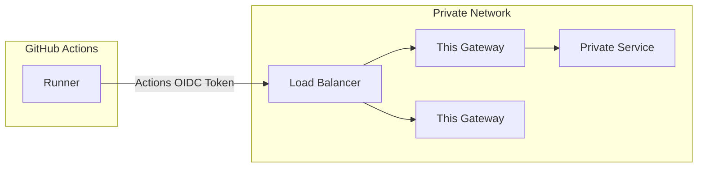

# actions-oidc-gateway-example

[](https://github.com/github/actions-oidc-gateway-example/actions/workflows/ci.yml)

Have you ever wanted to connect to a private network from a GitHub-hosted Actions runner?

This gateway is a reference implementation of how to authorize traffic from Actions into your private network, either as an API gateway or as an HTTP CONNECT proxy tunnel.

It is *not* intended to be used as-is.

At a minimum, you'd want to customize the claim check for your use case (see [Configuring the OIDC trust with the cloud](https://docs.github.com/en/actions/deployment/security-hardening-your-deployments/about-security-hardening-with-openid-connect#configuring-the-oidc-trust-with-the-cloud) for examples as to what's possible here). The default configuration only allows Actions from the repo `octo-org/octo-repo`.

Then, if you're using this as an API gateway, you probably want to customize the existing `/apiExample` handler (unless you **really** need proxied acccess to the Bing homepage?) You could add additional handlers, and even customize the claim checking per handler if you'd like.

Lastly, you are responsible for deploying this gateway in a secure way with access to your private network. There's lots of different options here, but you probably want this gateway to be behind a load balancer that speaks TLS, with scoped network access to the private services it provides access to. That will probably look something like this:



## How would I use this?

Once you customize and deploy your gateway, you can configure your Actions workflow to make use of it:

```
...

jobs:
  your_job_name:
    ...
    permissions:
      id-token: write
    steps:
      ...

      - name: Get OIDC token and set OIDC_TOKEN environment variable
        run: |
          echo "OIDC_TOKEN=$(curl -H "Authorization: bearer $ACTIONS_ID_TOKEN_REQUEST_TOKEN" -H "Accept: application/json; api-version=2.0" "$ACTIONS_ID_TOKEN_REQUEST_URL&audience=api://ActionsOIDCGateway" | jq -r ".value")"  >> $GITHUB_ENV
          echo "::add-mask::$OIDC_TOKEN"

      - name: Example of using gateway as a proxy
        run: |
          curl -v -p --proxy-header "Gateway-Authorization: ${{ env.OIDC_TOKEN }}" -x https://your-load-balancer.example.com https://www.google.com

      - name: Example of an API gateway
        run: |
          curl -v -H "Gateway-Authorization: ${{ env.OIDC_TOKEN }}" https://your-load-balancer.example.com/apiExample

    ...
```
